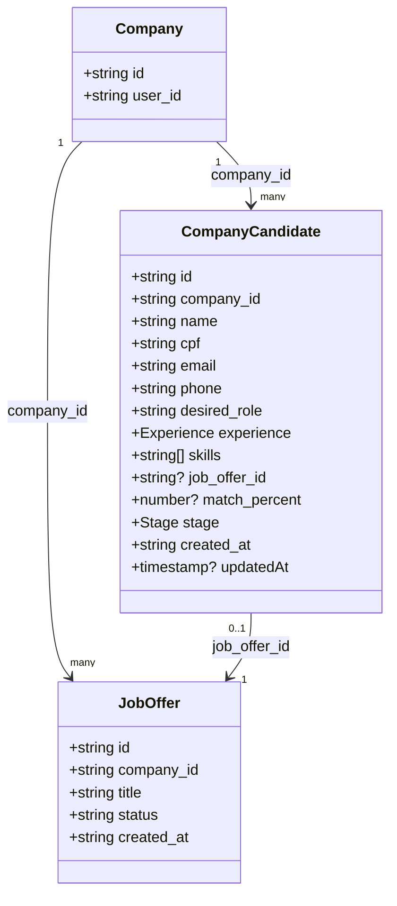

# Portal Conecta Caminhos

O **Portal Conecta Caminhos** é uma plataforma digital desenvolvida para facilitar a integração de migrantes em Portugal, conectando-os a oportunidades de emprego, serviços de apoio e orientação burocrática. O sistema serve como um ponto de encontro entre migrantes, empresas e entidades de apoio.

## 🚀 Funcionalidades Principais

### Para Migrantes
*   **Triagem Inicial Interativa**: Um assistente passo-a-passo que avalia a situação atual do migrante (localização, documentação, necessidades) para fornecer orientações personalizadas.
*   **Dashboard Personalizado**: Visualização do progresso, tarefas pendentes e recomendações baseadas no perfil.
*   **Gestão de Documentos**: Orientação sobre NIF, NISS e outros documentos essenciais.
*   **Apoio Multilíngue**: Interface totalmente traduzida em Português, Inglês e Espanhol.

### Para Empresas
*   **Registo e Perfil**: Criação de conta empresarial com validação de NIF e dados de contato.
*   **Publicação de Oportunidades**: Ferramentas para divulgar vagas e conectar-se com talentos.
*   **Gestão de Candidatos**: Cadastro, edição, eliminação, filtros, exportação (CSV/Excel) e visualização detalhada.

## 👥 Módulo de Candidatos (Dashboard • Empresa)

Rota: **`/dashboard/empresa/candidatos`**  
Página: [CandidatesPage.tsx](file:///Users/renatomenezes/Desktop/Projetos/Portal-CPC/app/Backup/Backup-CPC-main/src/pages/dashboard/company/CandidatesPage.tsx)

### Estrutura de dados (Firestore)

Coleção: **`company_candidates`**

Campos principais:
* `company_id` (string) — ID do documento em `companies`
* `name` (string)
* `cpf` (string) — armazenado apenas com dígitos
* `email` (string)
* `phone` (string)
* `desired_role` (string)
* `experience` (`junior | mid | senior`)
* `skills` (string[]) — lista normalizada (deduplicada)
* `job_offer_id` (string | null) — associação opcional com `job_offers`
* `match_percent` (number | null) — 0–100
* `stage` (`triage | interview | rejected | hired`)
* `created_at` (string ISO)
* `updatedAt` (timestamp opcional)

### Diagrama de classes



### Fluxo de dados (CRUD + filtros + exportação)

```mermaid
flowchart TD
  UI[CandidatesPage] -->|resolve companyId| CO[companies where user_id == uid]
  UI -->|listar/paginar| Q1[query company_candidates by company_id + order created_at]
  UI -->|filtrar localmente| F1[search (nome/cargo) + skills + experiência + match + vaga]
  UI -->|criar| C1[addDocument company_candidates]
  UI -->|editar| U1[updateDocument company_candidates/{id}]
  UI -->|eliminar| D1[deleteDocument company_candidates/{id}]
  UI -->|export CSV| E1[gera arquivo CSV no browser]
  UI -->|export Excel| E2[import lazy xlsx + gera .xlsx]
```

### Segurança (inputs e regras)

* Sanitização: remoção de caracteres de controlo, normalização de email/telefone e armazenamento de CPF apenas com dígitos.
* Validação: campos obrigatórios, email válido, CPF válido (dígitos verificadores), telefone mínimo, `match_percent` 0–100.
* Proteção contra SQL injection: não há SQL no backend (Firestore). Ainda assim, os inputs são sanitizados e as operações são feitas por APIs tipadas (`addDocument`, `updateDocument`, `deleteDocument`) e regras de segurança.
* Regras Firestore: [firestore.rules](file:///Users/renatomenezes/Desktop/Projetos/Portal-CPC/app/Backup/Backup-CPC-main/firestore.rules) inclui permissões para `company_candidates` e valida o vínculo `companies.user_id == request.auth.uid`.

### Testes

* Testes unitários: [CandidatesPage.test.ts](file:///Users/renatomenezes/Desktop/Projetos/Portal-CPC/app/Backup/Backup-CPC-main/src/pages/dashboard/company/CandidatesPage.test.ts)

## 👤 Perfil de Migrante (Dashboard • CPC / Migrante)

Coleção: **`profiles`**

Campos adicionais (Informação Pessoal):
* `address` (string) — morada completa (mín. 10 caracteres)
* `identificationNumber` (string) — apenas letras maiúsculas e números (máx. 20)
* `region` (`Lisboa | Norte | Centro | Alentejo | Algarve | Outra`)
* `regionOther` (string | null) — obrigatório quando `region == "Outra"`

### Funcionalidades Transversais
*   **Autenticação Segura**: Sistema de login e registo robusto via Firebase Auth.
*   **Design Responsivo**: Interface moderna e adaptável a dispositivos móveis e desktop.
*   **Geolocalização**: Integração de mapas para localização de serviços.

## 🛠️ Tecnologias Utilizadas

O projeto foi construído utilizando tecnologias modernas de desenvolvimento web, focadas em performance e experiência do utilizador.

### Core
*   **[React](https://react.dev/)**: Biblioteca JavaScript para construção de interfaces.
*   **[TypeScript](https://www.typescriptlang.org/)**: Superset de JavaScript com tipagem estática.
*   **[Vite](https://vitejs.dev/)**: Build tool rápida e leve.

### UI & Estilização
*   **[Tailwind CSS](https://tailwindcss.com/)**: Framework CSS utilitário.
*   **[shadcn/ui](https://ui.shadcn.com/)**: Coleção de componentes de UI reutilizáveis baseados em Radix UI.
*   **[Lucide React](https://lucide.dev/)**: Biblioteca de ícones consistente e leve.

### Gestão de Estado e Dados
*   **[TanStack Query](https://tanstack.com/query/latest)**: Gestão de estado assíncrono e data fetching.
*   **React Context**: Gestão de estado global (Autenticação, Idioma).

### Backend e Integrações
*   **[Firebase](https://firebase.google.com/)**: Plataforma backend-as-a-service.
    *   **Authentication**: Gestão de identidades e sessões.
    *   **Firestore**: Base de dados NoSQL em tempo real.

### Outras Ferramentas
*   **[React Router](https://reactrouter.com/)**: Navegação e roteamento (SPA).
*   **[React Hook Form](https://react-hook-form.com/)** + **[Zod](https://zod.dev/)**: Gestão e validação de formulários.
*   **[date-fns](https://date-fns.org/)**: Manipulação de datas.

## 📂 Estrutura do Projeto

```
src/
├── components/     # Componentes reutilizáveis (UI, Layout, Forms)
├── contexts/       # Contextos React (Auth, Language)
├── hooks/          # Custom Hooks
├── integrations/   # Configurações de serviços externos (Firebase, Supabase)
├── lib/            # Utilitários e configurações (i18n, utils)
├── pages/          # Componentes de página (Home, Triage, Dashboard, Auth)
└── styles/         # Estilos globais
```

## 🏁 Como Iniciar

### Pré-requisitos
*   Node.js (versão 18 ou superior)
*   npm ou yarn

### Instalação

1.  Clone o repositório:
    ```bash
    git clone <url-do-repositorio>
    cd portal-conecta-caminhos-main
    ```

2.  Instale as dependências:
    ```bash
    npm install
    ```

3.  Configure as variáveis de ambiente:
    Crie um arquivo `.env` na raiz do projeto com as credenciais do Firebase (exemplo baseado no setup atual).

### 🔐 Cadastro seguro (Auth hardening)

O fluxo de registo foi endurecido com:
* mensagem de erro mascarada no frontend (sem expor `Firebase`/`auth/*`);
* endpoint seguro em Cloud Functions (`registerUserSecure`);
* rate limit server-side por IP + hash de email;
* suporte a reCAPTCHA v3;
* `requestId` para rastreabilidade de incidentes.

#### Variáveis de ambiente (Frontend)

Crie `.env` na raiz (ou ajuste no ambiente de deploy):

```bash
# Firebase (já usado pelo projeto)
VITE_FUNCTIONS_REGION=us-central1

# CAPTCHA no browser (recomendado)
VITE_RECAPTCHA_SITE_KEY=your_recaptcha_site_key

# Fallback opcional (se já usar a mesma chave no App Check)
VITE_FIREBASE_APPCHECK_SITE_KEY=your_appcheck_site_key

# Ativa o registo via Cloud Function segura (default: false para evitar bloqueio por CORS sem deploy de functions)
VITE_USE_SECURE_REGISTER_FUNCTION=false
```

#### Variáveis de ambiente (Cloud Functions)

Defina no ambiente das funções:

```bash
# Obriga App Check nas callables sensíveis
ENFORCE_APPCHECK=true

# Chave secreta reCAPTCHA v3 (server-side)
RECAPTCHA_SECRET_KEY=your_recaptcha_secret

# Score mínimo do captcha
RECAPTCHA_MIN_SCORE=0.5
```

> Sem `RECAPTCHA_SECRET_KEY`, a função continua a operar, mas sem validação anti-bot de captcha.

#### Deploy (segurança)

1. Build de funções:
   ```bash
   cd functions && npm run build
   ```
2. Deploy:
   ```bash
   firebase deploy --only functions
   ```
3. Verificar no cliente se o registo continua funcional e sem erro técnico exposto.

#### CORS e domínio de produção (`registerUserSecure`)

A callable de registo usa **Cloud Functions Gen2** (`onCall` + `invoker: 'public'`) e uma lista explícita de **origens CORS** (ex.: `https://www.portalcpc.com`). Isto evita o erro de browser *“No 'Access-Control-Allow-Origin' header”* no preflight quando o site corre noutro domínio que não o hosting predefinido do Firebase.

* Se o site público usar **outro domínio ou subdomínio**, acrescente-o em `functions/src/registerUserSecure.ts` (`REGISTER_CORS_ORIGINS`) e faça **novo deploy** das functions.
* Com **`ENFORCE_APPCHECK=true`**, registe também o domínio em **Firebase Console → App Check** (sites autorizados), caso contrário as chamadas podem falhar após o CORS estar correto.

#### Checklist de validação ponta a ponta

* [ ] Registo com email novo funciona e autentica automaticamente.
* [ ] Registo com email já existente **não** mostra `Firebase`/`auth/*` na UI.
* [ ] Erro de rede mostra mensagem amigável (`networkError`).
* [ ] Múltiplas tentativas disparam bloqueio (`RATE_LIMITED`) com mensagem segura.
* [ ] Com captcha ativo, token inválido é bloqueado sem detalhe técnico.
* [ ] Logs no backend contêm `requestId` para troubleshooting.
* [ ] Linter, `tsc` e testes passam após alterações.

#### Runbook operacional

Para resposta a incidentes de autenticação/cadastro (rate limit, captcha, indisponibilidade do provedor), consultar:

* [Runbook de segurança de autenticação](docs/auth-security-runbook.md)

4.  Inicie o servidor de desenvolvimento:
    ```bash
    npm run dev
    ```

5.  Acesse a aplicação em `http://localhost:8080`.

## 🧪 Conteúdos de demonstração (CPC • Trilhas)

Esta funcionalidade permite exibir **conteúdo fictício/de exemplo** na rota **`/dashboard/cpc/trilhas`**, mantendo os conteúdos reais (vindos do Firestore) separados e com indicadores visuais claros.

### Objetivo
*   Fornecer uma **pré-visualização** de trilhas (cards com imagem/metadata) quando a base de dados não está populada ou quando é necessário demonstrar o fluxo.
*   Tornar os dados de demonstração **inequivocamente identificáveis** através de badges e rotulagem.
*   Reduzir tempo de carregamento com **cache local** (stale-while-revalidate).

### Como usar
1. Aceda a **`/dashboard/cpc/trilhas`**
2. Utilize o botão **“Mostrar demonstração”** para revelar a secção de conteúdos de exemplo
3. Utilize **“Ocultar demonstração”** para esconder a secção
4. O botão **“Criar trilhas demo”** (já existente) cria trilhas e módulos na base de dados (Firestore) — isto é diferente do modo demonstração (que não persiste dados)

### Onde fica implementado
*   Página: [TrailsAdminPage.tsx](file:///Users/renatomenezes/Desktop/Projetos/Portal-CPC/app/Backup/Backup-CPC-main/src/pages/dashboard/cpc/TrailsAdminPage.tsx)
*   Testes: [TrailsAdminPage.test.tsx](file:///Users/renatomenezes/Desktop/Projetos/Portal-CPC/app/Backup/Backup-CPC-main/src/pages/dashboard/cpc/TrailsAdminPage.test.tsx)

### Estrutura de dados (demo)
Os conteúdos de demonstração são definidos como uma lista de objetos com os campos:
* `title` (título)
* `description` (descrição)
* `image_url` (imagem/thumbnail)
* `duration_minutes` (duração)
* `category` (categoria)
* `created_at` (data de criação)

Cada card apresenta ainda badges de **categoria**, **dificuldade** e um badge explícito **Demo**.

### Diferenciação visual (real vs demo)
* Conteúdos reais: renderizados na secção **“Trilhas existentes”** e abrem o editor (`/dashboard/cpc/trilhas/:trailId`)
* Conteúdos demo: renderizados na secção **“Conteúdos de demonstração”**, com badge **Demo** e texto informativo indicando que **não são gravados na base de dados**

### Cache (otimização de carregamento)
Implementado em `localStorage` com estratégia **stale-while-revalidate**:
* Chave: `cpc-trails-cache:v1`
* Formato: `{ ts: number, data: Trail[] }`
* TTL: **5 minutos**
* Com cache válido, a página renderiza imediatamente e faz atualização em background (indicador “Atualizando…”)

A preferência de exibição de demo é persistida em:
* Chave: `cpc-trails-demo:show` (`true`/`false`)

## 🔁 Alternância de visualização (CPC • Trilhas existentes)

Na mesma rota **`/dashboard/cpc/trilhas`**, a secção **“Trilhas existentes”** suporta alternância entre:
* **Grade (grid)**: cards responsivos com imagem, título e resumo
* **Lista (list)**: linhas com detalhes (título, descrição, data, status) e ações (ex.: editar)

### Onde fica implementado
* Página: [TrailsAdminPage.tsx](file:///Users/renatomenezes/Desktop/Projetos/Portal-CPC/app/Backup/Backup-CPC-main/src/pages/dashboard/cpc/TrailsAdminPage.tsx)
* Testes: [TrailsAdminPage.test.tsx](file:///Users/renatomenezes/Desktop/Projetos/Portal-CPC/app/Backup/Backup-CPC-main/src/pages/dashboard/cpc/TrailsAdminPage.test.tsx)

### Estado e persistência
* Estado: `viewMode` (`'grid' | 'list'`)
* Persistência: `localStorage` com a chave `cpc-trails:viewMode`
* Comportamento: ao recarregar a página ou ao navegar e voltar, o modo selecionado é restaurado automaticamente

### UI e eventos
Implementado com `ToggleGroup` (shadcn/ui), usando:
* `type="single"`
* `value={viewMode}`
* `onValueChange={(v) => ...}` para atualizar o estado e persistir em `localStorage`
* `ToggleGroupItem value="grid"` e `ToggleGroupItem value="list"` para trocar o modo

### Testes
Testes cobrem:
* Toggle de demonstração (mostrar/ocultar)
* Render rápido via cache + atualização em background
* Cenário de erro + fallback para demonstração
* Alternância de visualização (grade/lista) + persistência em `localStorage`

Para executar:
```bash
npm run test:run
```

## 🤝 Contribuição

Contribuições são bem-vindas! Por favor, siga as boas práticas de desenvolvimento, mantenha o estilo de código consistente e certifique-se de testar suas alterações.

### Internacionalização (i18n)
As traduções ficam em:
* `src/locales/pt.json`
* `src/locales/en.json`
* `src/locales/es.json`

Na UI, use o hook `useLanguage()` e renderize via `t` (proxy tipado) ou `t.get(path, params)`:
* `t.nav.login`
* `t.cpc.profile.title`
* `t.get('policies.common.lastUpdated', { date: '2026-03-19' })`

Regras:
* Nunca introduza texto estático hardcoded em páginas/componentes; crie uma chave de tradução.
* Mantenha as chaves sincronizadas nos 3 idiomas (há um teste de integridade que falha se houver divergências).
* Use namespaces curtos e estáveis (`common`, `nav`, `dashboard`, `cpc`, `migrant`, `messagesPage`, `policies`, …).
* Use placeholders com `{nome}` para interpolação e passe valores via `t.get(path, params)`.
* Fallback: se uma chave não existir no idioma atual, a aplicação usa `pt` e regista a chave em `localStorage` (`cpc-i18n-missing`).

Chaves adicionadas recentemente:
* `policies.*` (páginas legais Cookies/Privacidade)
* `messagesPage.*` (UI de mensagens: títulos, labels, aria, erros e toasts)
* `common.errorTitle`, `common.validationTitle`, `common.notFoundTitle`, `common.create`, `common.retry`, `common.languages.*`
* `dashboard.session_types.*`, `dashboard.support_types.*`
* `cpc.profile.*`

---

Desenvolvido com foco na inclusão e apoio à comunidade migrante em Portugal.

---

Desenvolvido com ❤️ por [NEOPULSE](https://neopulse.group/)
